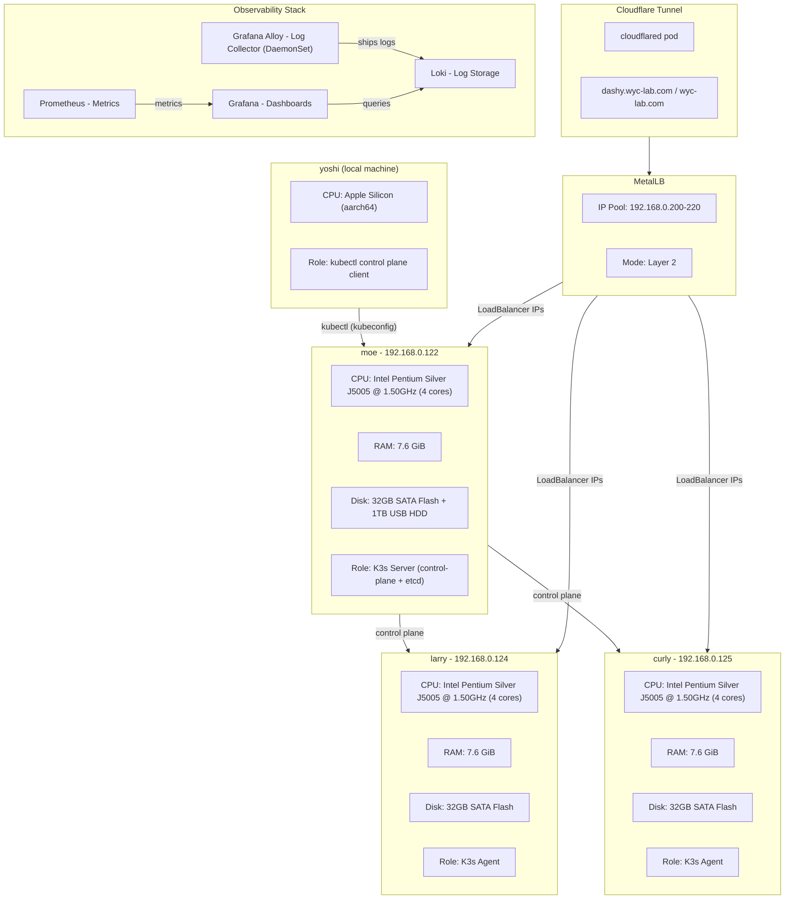

# K3s Lab Cluster Topology

## Hosts

| Hostname | IP | Role | CPU | RAM | Disk |
|----------|----|------|-----|-----|------|
| moe | 192.168.0.122 | K3s server (control-plane + etcd) | Intel Pentium Silver J5005 (4C) | 7.6 GiB | 32GB + 1TB USB |
| larry | 192.168.0.124 | K3s agent | Intel Pentium Silver J5005 (4C) | 7.6 GiB | 32GB |
| curly | 192.168.0.125 | K3s agent | Intel Pentium Silver J5005 (4C) | 7.6 GiB | 32GB |
| yoshi | local | kubectl client | Apple Silicon (aarch64) | - | - |

## Applications

### Wallabag

| Field | Value |
|-------|-------|
| URL (LAN) | http://192.168.0.203 |
| URL (External) | https://wallabag.wyc-lab.com |
| Default user | wallabag |
| Default pass | wallabag (change after first login) |

## Networking

| Component | Details |
|-----------|---------|
| **MetalLB** | Bare-metal load balancer, Layer 2 mode |
| **IP Pool** | `192.168.0.200` – `192.168.0.220` |
| **CNI** | Flannel (K3s default) |
| **Pod CIDR** | `10.42.0.0/16` |
| **Service CIDR** | `10.43.0.0/16` |

## Services

| Service | URL (LAN) | URL (External) | Namespace |
|---------|-----------|----------------|-----------|
| Dashy | http://192.168.0.200 | https://dashy.wyc-lab.com | dashy |
| Loki | http://192.168.0.201:3100 | - | observability |
| Grafana | http://192.168.0.201 | https://grafana.wyc-lab.com | observability |
| Prometheus | http://192.168.0.202 | https://prometheus.wyc-lab.com | observability |
| Wallabag | http://192.168.0.203 | https://wallabag.wyc-lab.com | wallabag |

## Storage

- **/wyc-kubernetes-labs** on moe — 1TB USB HDD mounted at `/wyc-kubernetes-labs` for config backups and documentation

## Backup Configs

See [cluster-backups/](./cluster-backups/) for exported cluster state (nodes, services, deployments, tunnel config, MetalLB pool, Dashy, Loki, Alloy).
