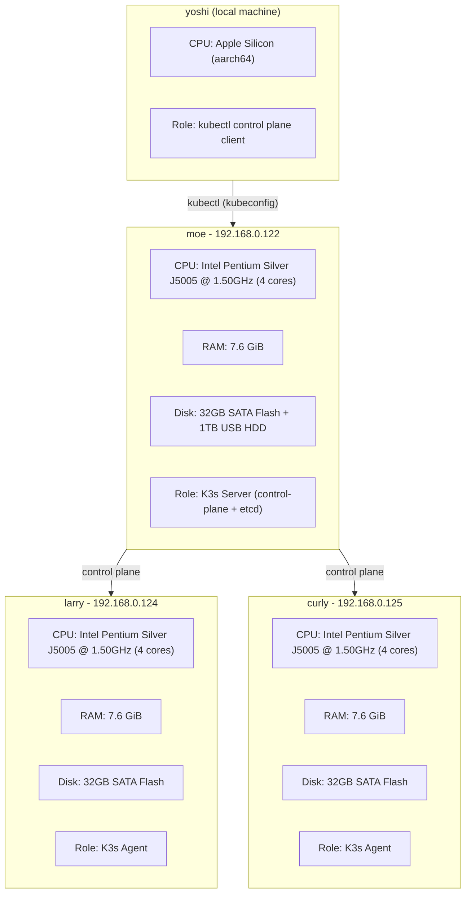

# K3s Lab Cluster Topology

## Hosts

| Hostname | IP | Role | CPU | RAM | Disk |
|----------|----|------|-----|-----|------|
| moe | 192.168.0.122 | K3s server (control-plane + etcd) | Intel Pentium Silver J5005 (4C) | 7.6 GiB | 32GB + 1TB USB |
| larry | 192.168.0.124 | K3s agent | Intel Pentium Silver J5005 (4C) | 7.6 GiB | 32GB |
| curly | 192.168.0.125 | K3s agent | Intel Pentium Silver J5005 (4C) | 7.6 GiB | 32GB |
| yoshi | local | kubectl client | Apple Silicon (aarch64) | - | - |

## Storage

- **/wyc-kubernetes-labs** on moe — 1TB USB HDD mounted at `/wyc-kubernetes-labs` for config backups and documentation
